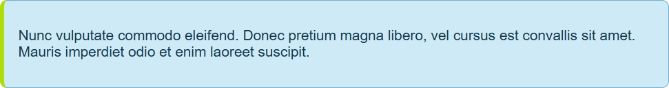
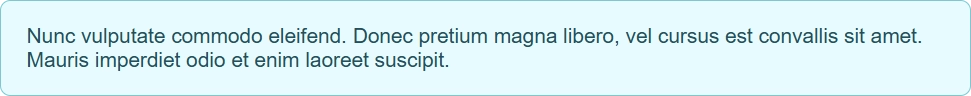
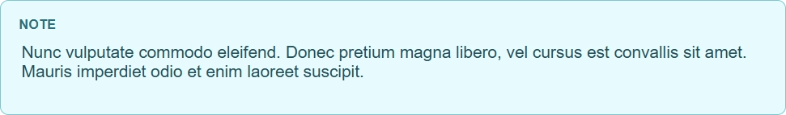
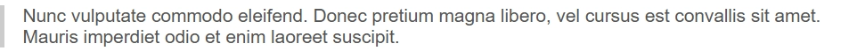

# Markdown 2 HTML
Converts a markdown directory into a website with static HTML pages. 
Great for a simple website, or for documentation for an application.
See the `sample` folder for an example website. To compile use the following
then open `output/index.html`.

```
dart run bin/markdown2html.dart -i sample -o output
markdown2html -i sample -o output
```

Configuration file controls a few things for the output. 

| Config         | Notes                                                                                                                | Example                                    |
| -------------- |----------------------------------------------------------------------------------------------------------------------|--------------------------------------------|
| `logo`         | The logo file that will be shown at the top of the sidebar.                                                          | `logo.webp`                                |
| `logoAlt`      | the alt text for readers                                                                                             | `Site Logo`                                |
| `css`          | The css file to be included in all pages. Supports light and dark modes.                                             | `site.css`                                 |
| `favicons`     | Include or not, any favicon* files found.                                                                            | `true`                                     |
| `sitebarTitle` | The text that will be shown bwteen the top of all site links and under the logo. `null` to not include one.          | `null` or `Your site name`                 |
| `footer`       | If not `null` include the markdown in the specified markdown file as the footer for each page.                       | `null` or `999-footer.md`                  |
| `top-nav`      | If not `null` there will be a link above the logo. For a documentation site, this might point back to the main site. | `null` or `{"url":"/","title":"Top Link"}` |

```json
{
  "logo": "logo.webp",
  "logoAlt": "Site logo",
  "css": "site.css",
  "favicons": true,
  "sidebarTitle":"Your site name",
  "footer": null,
  "top-nav": {
    "url": "/",
    "title": "Top Link"
  }
}

```

# Fav Icons
When `favicons` is **true**, will include the following in the head tag. The filenames are whatever youor favicons
are, but are expected to be png images with a similar nameing format.

```html
  <link rel="icon" href="favicon-16x16.png" sizes="16x16" type="image/png">
  <link rel="icon" href="favicon-32x32.png" sizes="32x32" type="image/png">
  <link rel="icon" href="favicon-48x48.png" sizes="48x48" type="image/png">
  <link rel="icon" href="favicon-64x64.png" sizes="64x64" type="image/png">
```

# Block quotes
In the `site.css` is a `blockquote` tag to handle markdown block quotes. 
Here are a few ways to display a blockquote that you might find interesting. 

## With color on edge
Colored rounded rectangle with color on the side.



```html
.content blockquote {
    position: relative;
    margin: 0;
    padding: 0.9rem 1.25rem 0.9rem 1rem;
    color: var(--note-fg);
    background: var(--note-bg);
    border: 1px solid var(--note-border);
    border-left: 5px solid var(--note-accent);
    border-radius: 8px;
}
```

## Colored rounded rect
Colored rounded rectangle:



```html
.content blockquote {
  position: relative;
  margin: 0;
  padding: 0.1rem 1.25rem;
  color: #24505a;
  background: #e6fbff;
  border: 1px solid #7fc7d1;
  border-radius: 8px;
}
```

## Note
A 'NOTE' added to the top of the text:



```html
.content blockquote {
  position: relative;
  margin: 0;
  padding: 1.5rem 1.25rem 1rem 1.25rem;
  color: #24505a;
  background: #e6fbff;
  border: 1px solid #7fc7d1;
  border-radius: 8px;
}

.content blockquote::before {
  content: "Note";
  position: absolute;
  top: 1rem;
  left: 1.1rem;
  font-size: 0.75rem;
  font-weight: 700;
  color: #2b6f7a;
  text-transform: uppercase;
  letter-spacing: 0.04em;
}
```

## Standard block quote
Something you would see in Obsidian.



```html
blockquote {
  margin: 1rem 0;
  padding-left: 1rem;
  border-left: 4px solid #ccc;
  color: #555;
}
```